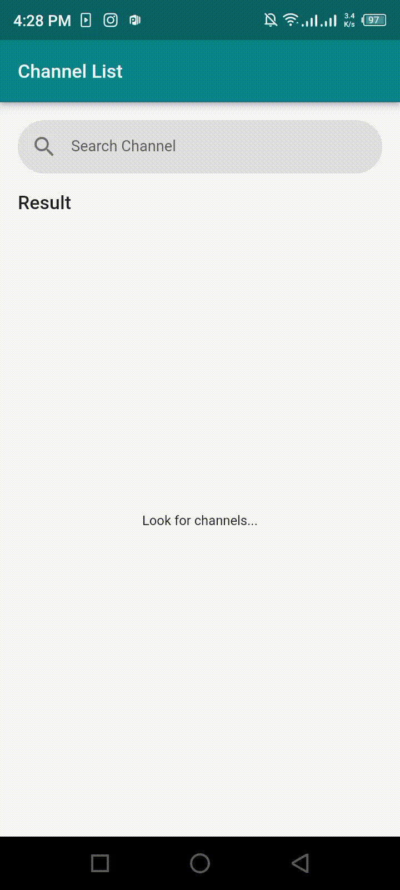

# Flutter Youtube Channel Search

A simple youtube channel search using Youtube API Data.

## Features

* Search channel
* Endless scroll list
* Channel detail

## Preview

## Dependencies
* [http](https://pub.dev/packages/http)
* [flutter_bloc](https://pub.dev/packages/flutter_bloc)
* [kiwi](https://pub.dev/packages/kiwi)
* [bloc](https://pub.dev/packages/bloc)
* [equatable](https://pub.dev/packages/equatable)
* [json_annotation](https://pub.dev/packages/json_annotation)

## Dev Dependencies
* [build_runner](https://pub.dev/packages/build_runner)
* [json_serializable](https://pub.dev/packages/json_serializable)

## License
Licensed under the [MIT license](https://opensource.org/licenses/MIT).